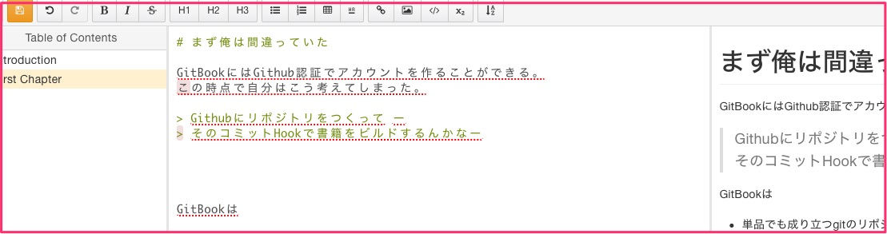

# まず俺は間違っていた

GitBookにはGithub認証でアカウントを作ることができる。
この時点で自分はこう考えてしまった。

> Githubにリポジトリをつくって ー  
> そのコミットHookで書籍をビルドするんかなー

100%間違ってるというわけではないが、そんな単純なサービスでは無かった。

GitBookは

- 単品でも成り立つgitのリポジトリサービスでもある
- オンラインのエディタを備えている。
    - もちろんgitのワークフローに乗せて文書を編集できる

このチャプターもオンラインのエディタで作成している。

このエディタはプレビューもできるし、ショートカットキー(OSXのデフォルトとかち合わないように結構配慮されている。)でMarkDownのsyntaxを挿入することもできた。