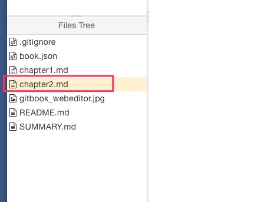

# チャプターを追加＆TOCのタイトルを変えたい

とりあえずチャプター1を作成し、Publishしてみた。
内容は編集した通りで、TOCが次のようにデフォルトのままだ。

- Introduction
    1. First Chapter

むむ、チャプタ−１は`まず俺は間違っていた`でなければならない。どうやらチャプター2ではその変更の仕方を調べていく必要があるな。


## chapter2のファイルを作成する

エディタのファイルツリー部分で**右クリック**すると、コンテキストメニューが登場。ここからファイルの新規作成ができた。



内容はこのチャプターだ。方法を調べながら書き進めている。

## SUMMARY.mdを編集する

ファイル一覧を観察すると、`SUMMARY.md`というファイルがある。怪しい。

内容を確認する。

```markdown:SUMMARY.md
# Summary

* [First Chapter](chapter1.md)
```

おそらくGitBook上で公開する場合のTOCはこれが使われるのだと推測。