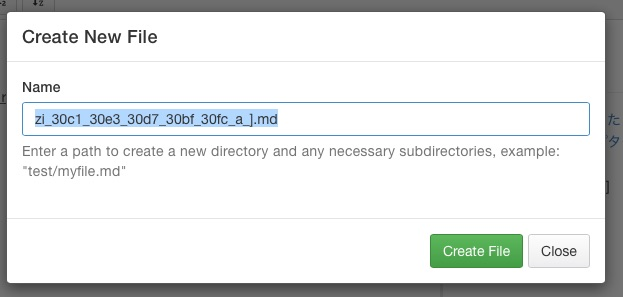

# 子チャプターA

では`子チャプターA`をクリック。さっきと同じようにダイアログが開く！



見出しから気を利かせてファイル名を生成してくれた模様だ。。  
申し出は遠慮して、ここは`chapter3-1.md`というファイル名でつくろう。毎度ながら内容はこのチャプターそのものです。


## SUMMARY.mdも自動で反映

ツリーの手動更新時点では`子チャプターA`に対応するファイルを指定しなかったが、ファイルの新規作成完了後、自動的に保管された。


```
# Summary

* [Introduction](README.md)
* [まず俺は間違っていた](chapter1.md)
* [さあ、新しいチャプターを！](chapter2.md)
* [見出しでツリー](chapter3.md)
   * [[子チャプターA]](chapter3-1.md)   ## ()の中身が補完された。
```

賢いなあ。

ただ、ファイルへのリンクが保管されると同時に、タイトルのほうが`[[子チャプターA]]`となってしまった。ファイルを省略してツリーだけ書くときは、仮のMarkDownタグはつけないほうがよいね。

