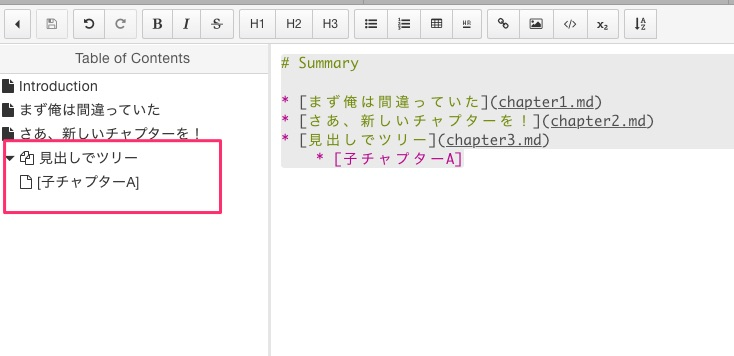
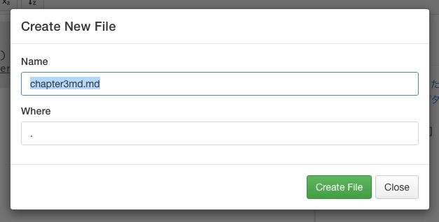

# 見出しでツリー

先に`SUMMARY.md`を編集したらどうなるんだろうと、ありもしない`chapter3.md`を指すチャプター3と、その子、`子チャプターA`を追記した。

```
# Summary

* [まず俺は間違っていた](chapter1.md)
* [さあ、新しいチャプターを！](chapter2.md)
* [見出しでツリー](chapter3.md)
    * [子チャプターA]
```

するとエディタ上のTOCには普通にそれらが現れた。




