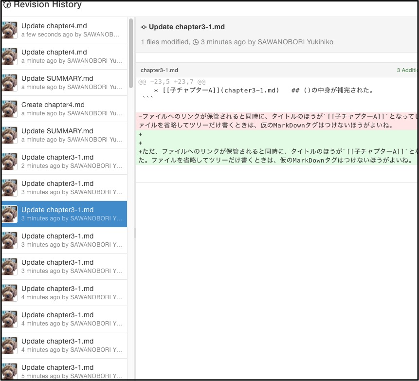
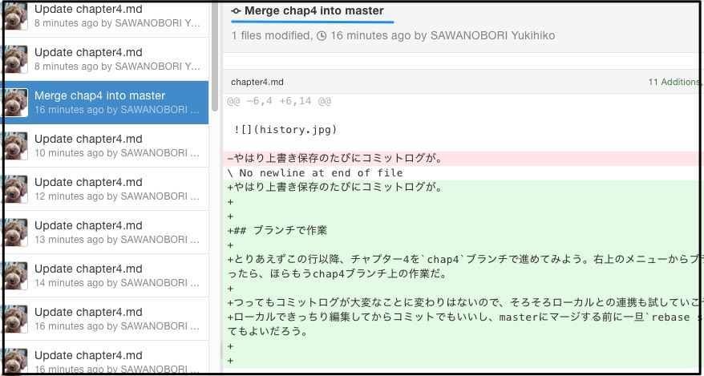

# 履歴が大変なことに

ここまでオンラインエディタで作業を進めてきた。前述のとおりショートカットキーがあるので、手を休めるたびに癖で**[CMD+S(保存)]**とかしています。

...これGitリポジトリなんだよなと思い、履歴を開いてみる。

やはり上書き保存のたびにコミットログが。

## ブランチで作業

とりあえずこの行以降、チャプター4を`chap4`ブランチで進めてみよう。右上のメニューからブランチを作ったら、ほらもうchap4ブランチ上の作業だ。

つってもコミットログが大変なことに変わりはないので、そろそろローカルとの連携も試していこう。
ローカルできっちり編集してからコミットでもいいし、masterにマージする前に一旦`rebase squash`してもよいだろう。

で、マージをしてみた。一応マージコミットを確認すればひとかたまりとしての差分はわかるので、オンラインだけでもそこまで苦にはならなさそうだね。

