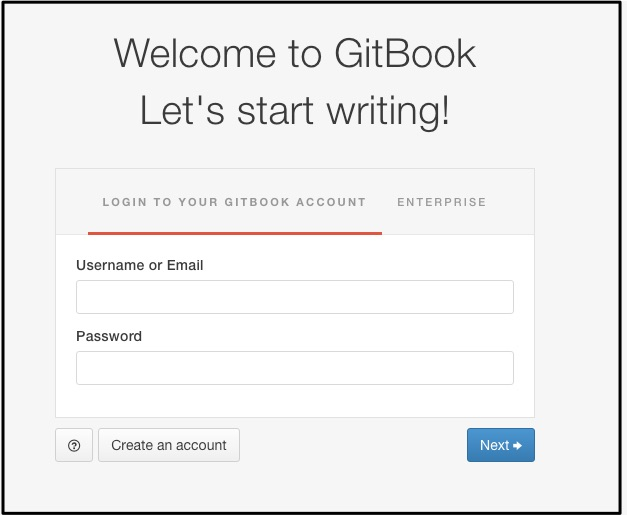
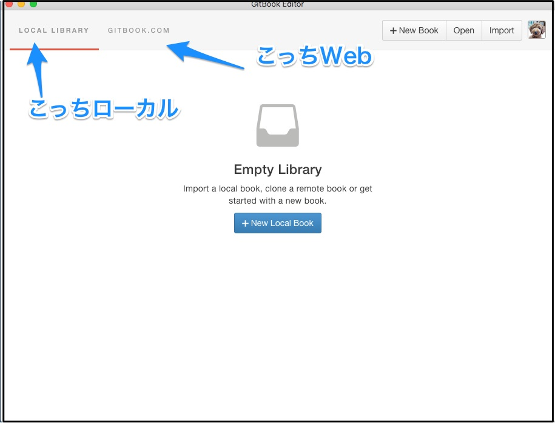
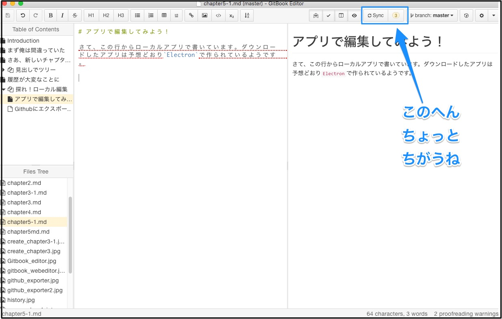

# アプリで編集してみよう！

さて、この行からローカルアプリで書いています。ダウンロードしたアプリは予想どおり`Electron`で作られているようです。

ローカルアプリはGithub連携ログイン、とはさすがにいかないようで、GitBookのパスワードを設定しておかないといけません。

## アプリの役割は大きく3つ。

- gitbookプロジェクト管理のフロントエンド
- `gitbook.com`との同期
- Web版と同じエディタ

まず初期画面。Webの`gitbook.com`と同期したり、ローカルに新規orインポートが選べるようだ。

ローカルに新規作成できたりするのはもやはIDEぽいね。

早速この本を同期してローカルで開いてみる。

編集機能は同じ、保存したらコミットされる点も一緒だ。当然だがWeb版よりサクサク動く。