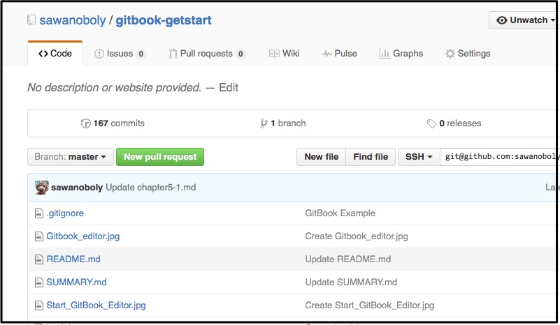
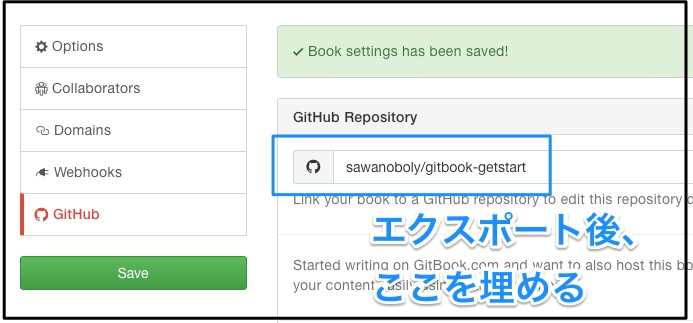
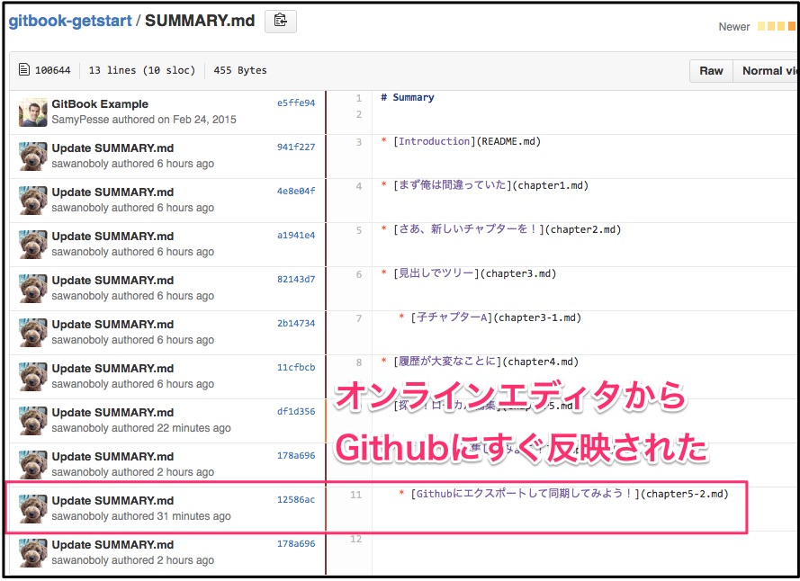
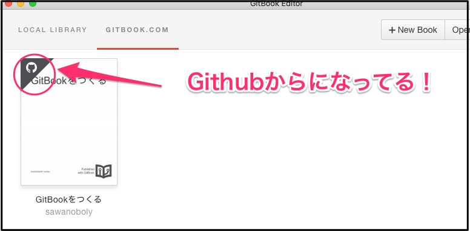

# Githubにエクスポートして同期してみよう！(chapter5-2)

`gitbook.com` + ローカルアプリが快適で、一人で何かを書くときにはもうこれでいいやとなっている気分を押し殺しながらGithub連携を試していくよ。

このチャプターはGithub連携を作成して、かつオンラインエディタで書き始めています。

## 連携する意味を考える

`gitbook.com`になくてgithubだけにあり、連携したほうが良い場合に使うもの。

- Pull Request
- 他サービスとのHook連携
- gitリポジトリのViewer
- リリース
- マイルストーン

※ Issueにあたるものは`gitbook.com`でもdiscussionがある

この中でも、まあやっぱりプルリクエストだよね。多分それと同じくらいでサービス連携がくるかな。
複数人で作業するならやっぱりプルリクエストでレビューとかしたいし、gitリポジトリとして取り回しがしやすくなるのも大きい。CIからCLIの`gitbook`でリリースに本を置いたりできるしね。

ただ、編集のしやすさが損なわれるのは嫌だなあと思ったら**そんなことは全く無かった**。
本チャプターの冒頭は連携状態でのオンラインエディタを試していたが、すでにこの段落はローカルアプリで書いているのだ。

## Githubにエクスポートする

設定画面からGithubの項目を選ぶと、エクスポートと連携設定ができる。ひとまずエクスポートだ。

Githubのインポーターに遷移するので、項目を埋めてcloneしよう。クローン時には認証を挟むため、`gitbook.com`側のアカウント情報を入力する必要がある。

するとこのように、見慣れたGithubプロジェクトが完成する。

もうなんか安心するわ。

## エクスポートしたリポジトリと、あらためて連携を作る

エクスポートしただけの状態では、双方に同じものがあるだけになる。

> ここでGithubアカウントのパーミッションを強め許しておけば勝手に連携しそうだったが、今回はしていなかったので一部を手動で設定した。

さっきGithubとの連携を作成した画面にもどり、連携先を設定してみた。

このあとWebHookを作るように言われたので、URLをコピーしてGithub側にWebHookを作成。

## その後、オンラインエディタが直接Githubを更新するようになる

そして気になるのは、この連携を作成した後でオンラインのエディタはどうなるのという点だった。

本チャプター用のファイルを追加すべく、`SUMMARY.md`を編集してみたところ、Githubに即反映されるじゃないか。(※セーブは以前より時間がかかる様子だった。)

おおう。。使用感そのままでメインリポジトリをGithubにできるんだ。

## ローカルアプリのエディタは別の取得先と認識、新規に同期へ

ローカルのアプリを再度起動、`gitbook.com`から取得していたリポジトリを競合とか嫌だし一旦消した。

そしてWeb側の一覧を見ると、Githubマークが。要はGithubから取得しまっせということになってる。

もう見るだけでイメージつくわ。無事にこのチャプターの続きをローカルで