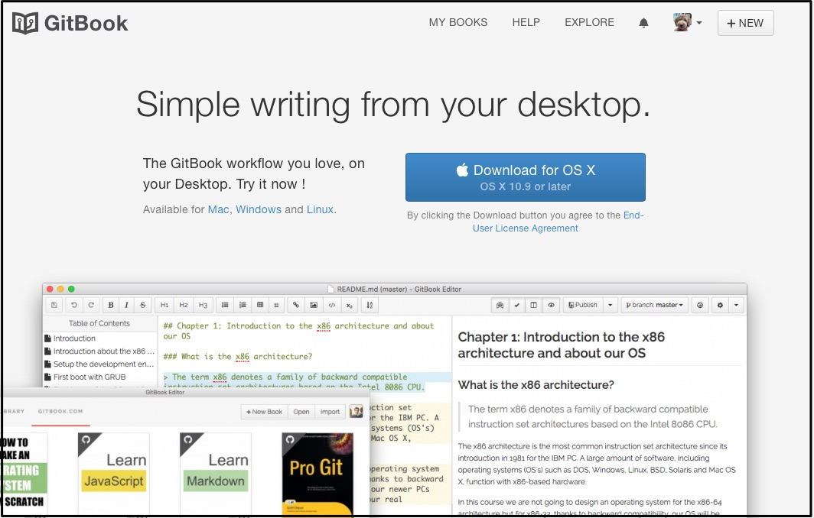
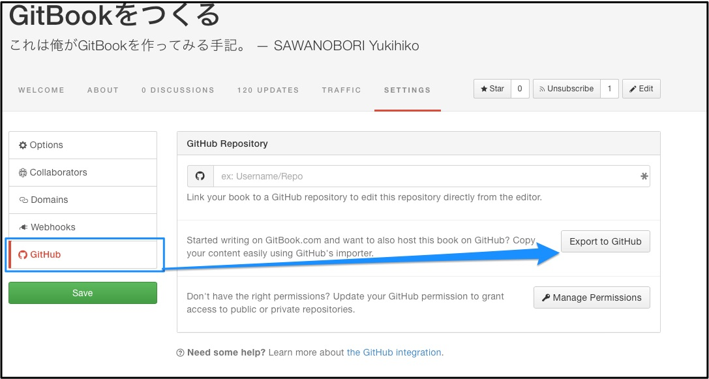

# 探れ！ローカル編集

ローカル ー というよりは、オンラインエディタ以外の方法にはどのようなものがあるのだろうという視点でいくつか探っていこう。

## GitBook Editorアプリ

`GitBook.com`のWebで下部メニューを見ていると、`EDITOR`という文字がある。
オンラインエディタのことかと思って表示すると、そこにはアプリが。

えっ、すごいな。オンラインで使っているJSをそのまま突っ込んでるんだろうけども。

## Githubにエクスポート&同期

Book(プロジェクト)の管理画面には、Githubと連携する設定がある。

